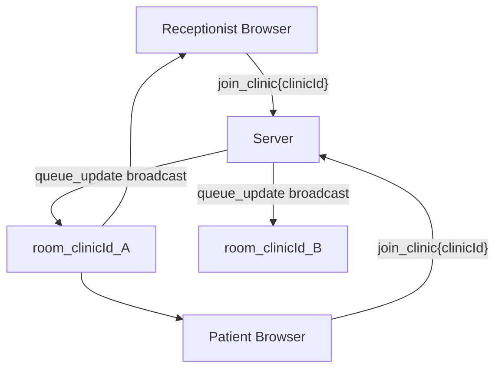
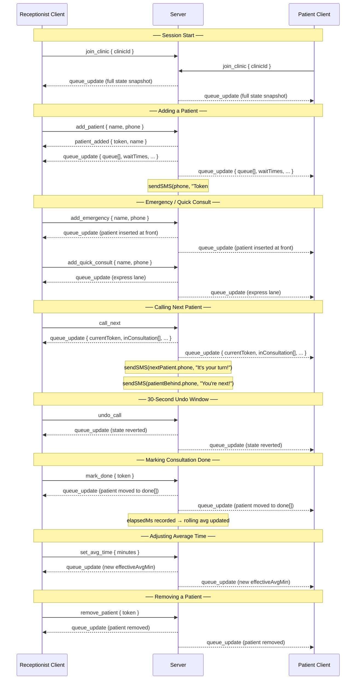
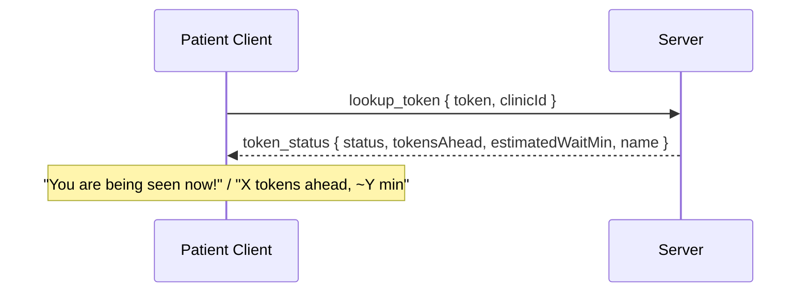
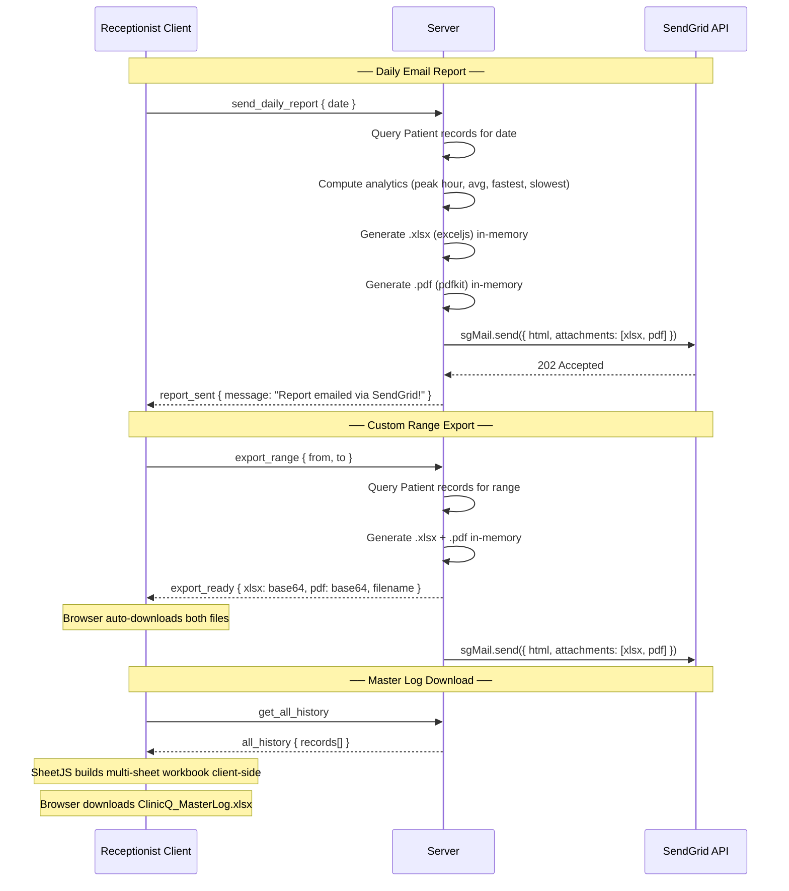
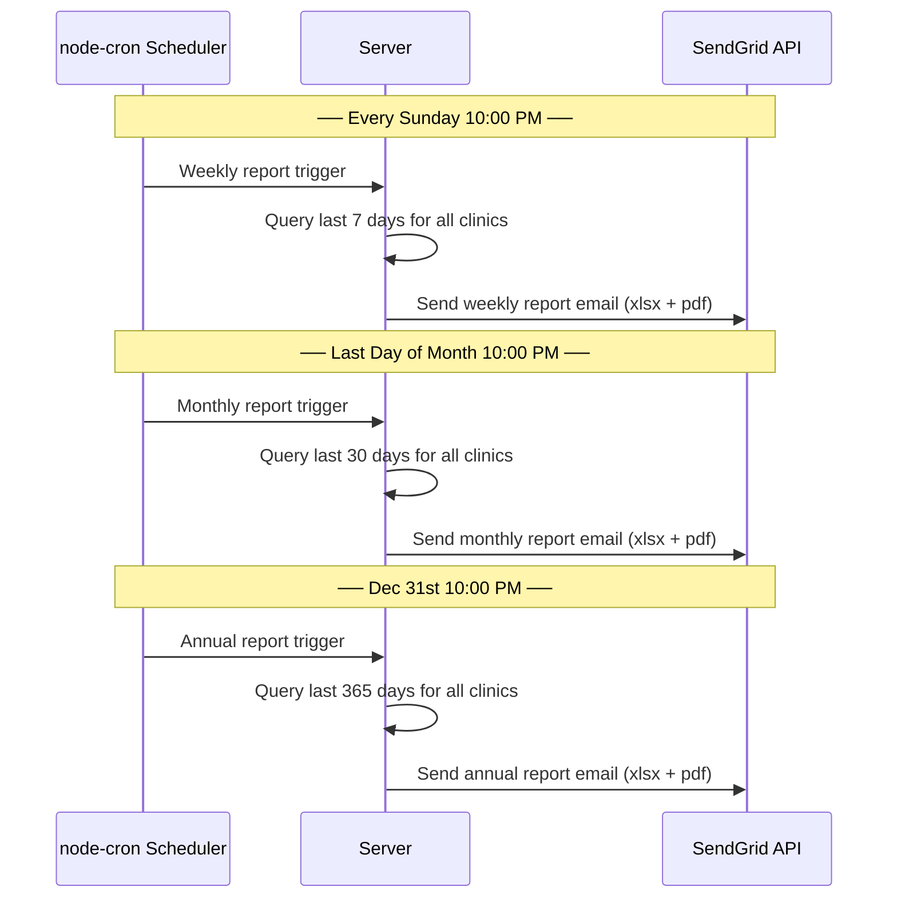

# ClinicQ — Socket Event Diagram

This document illustrates the complete real-time communication architecture of ClinicQ using Socket.IO WebSockets. All state changes are server-authoritative and broadcast instantly to every connected client within the same clinic room.

---

## Multi-Tenant Room Architecture

Every clinic operates in its own isolated Socket.IO **room** (`room_<clinicId>`). Events are never leaked between clinics.



---

## Main Queue Flow



---

## Patient Token Lookup Flow



---

## Reporting & Export Flow



---

## Automated Periodic Reports (Server-Side Cron)



---

## State Broadcast Payload Reference

Every `queue_update` event carries the following full state object:

```json
{
  "currentToken": 7,
  "nextToken": 8,
  "queue": [
    { "token": 8, "name": "Meera Singh", "phone": "+919876543210", "status": "waiting" },
    { "token": 9, "name": "Rohan Das",   "phone": "+919123456789", "status": "waiting" }
  ],
  "inConsultation": [
    { "token": 7, "name": "Ravi Kumar", "consultStartTime": "2026-06-20T14:23:00Z" }
  ],
  "done": [],
  "waitTimes": { "8": 3, "9": 11 },
  "effectiveAvgMin": 8,
  "avgSource": "real",
  "completedCount": 6,
  "totalServedToday": 6,
  "undoAvailable": false
}
```

---

*Generated by ClinicQ · [GitHub](https://github.com/77-Div-77/Clinic-Queue) · [Live Demo](https://clinic-queue-production-90c9.up.railway.app)*
